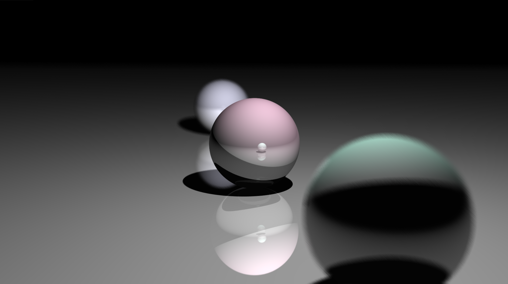
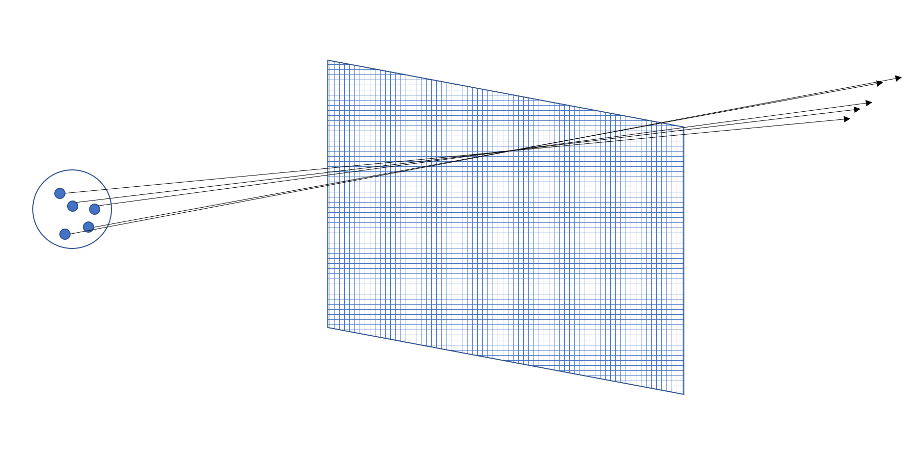

# Overall

My homework 1 is done under the Optix API.

## Special Implementation

I add a simple implementation to achieve the depth of view effect. Shown below:

You can see the balls in the front and black are out of focus and have been blurred.

My implementation is using multiple sample rays. Instead of sending one ray from the "eye" position, I make the eye position as a center of a ball with radian $r$, and sample different starting points on that ball to make sample rays. The sampling method is rejection sampling. Then, I send 200 rays for each pixels and average the color.

