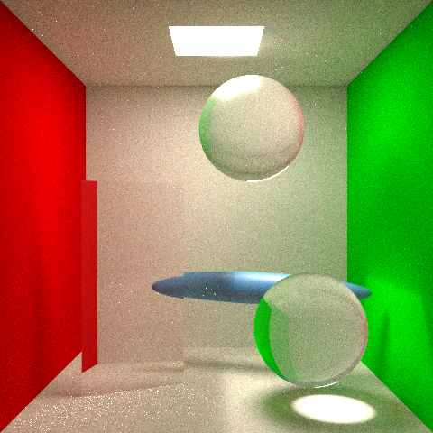

# Overall

As stated in my project proposal, I choose the option "Extending Path Tracer with Modern Algorithms". My plan is to implement the below features: 

1. GGX BSDF based on this paper: https://www.cs.cornell.edu/~srm/publications/EGSR07-btdf.pdf
2. Texture mapping.
3. Photon  mapping

If I have enough time, I might try to add environment lighting.

# Milestone

Now, I added a simple BSDF that assume all out-going rays have same throughput. I use Schlick’s approximation I handle the probability of refraction and total internal reflection. Currently, I don't implement the importance sampling, so the noise is high. The image below is rendered under $spp = 4096$. Although the current BSDF is simple, the refraction and caustic are presented pretty well.

